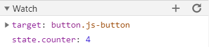

# Demo JavaScript debugging

## Console

The very, very, very basics, but here are some tips:

- Use `console.log({ a, b })` instead of `console.log(a, b)`;
- Use `console.dir()` to display a list of properties of an Object, e.g. `console.dir(window.location)`.
- Use `console.table()` for Objects or Arrays.

And check the [console documentation on MDN](https://developer.mozilla.org/en-US/docs/Web/API/Console/dir).

## Browser Dev tools

### Debugger statement

The easiest way to debug your JavaScript code is by adding a [`debugger` statement](https://developer.mozilla.org/en-US/docs/Web/JavaScript/Reference/Statements/debugger). When the debugger is invoked, execution is paused at the debugger statement.

```js
const toggle = (el, show) => {
   if (typeof show === 'boolean') {
     el.hidden = show;
   } else {
     el.hidden = !e.hidden;
   }

  debugger; // the browser pauses execution here

  return el.hidden;
}
```

### Stepping

You can now _step thru the code_.


1. Resume (`F8` or `F5` in VS Code).
2. Step over next _function call_ (`F10`).
3. Step into _function call_ (`F11`).
4. Step out of _current function_ (`Shift + F11`).

### Watch expressions

Watch the values of expressions change over time. This is especially valuable in the case of (reactive) state or data.



### Breakpoints

Directly add breakpoints to your code in the `Sources` (Chrome) or `Debugger` (Firefox) panel. **When you are working with transpiled or minified code, you have to enable `source maps` maps in the build step!**

### Logpoints

These work simarly as breakpoints with the exception that they don't pause execution and log the output of the expression in the console.

## VS Code debug Client-side code

You need to install the following extension for your browser(s):

- [Debugger for Chrome](https://marketplace.visualstudio.com/items?itemName=msjsdiag.debugger-for-chrome)
- [Debugger for Firefox](https://marketplace.visualstudio.com/items?itemName=firefox-devtools.vscode-firefox-debug)

Then you need to add a `launch configuration`.

```json
{
  "type": "firefox",
  "request": "launch",
  "name": "Launch: Firefox",
  "url": "http://localhost:8080",
  "webRoot": "${workspaceFolder}/src"  
}
```

Now you are ready to start debugging from [within VS Code](https://code.visualstudio.com/docs/editor/debugging).

## VS Code debug Node.js

The Node.js script has to be running with the  `--inspect` enabled. The default debugging host and port are `127.0.0.1:9229`, but you can easily change this e.g. `node --inspect=0.0.0.0:9230 script.js`.

### Skipping uninteresting code (Node, Chrome)

You probably don't want to debug internal Node.js scripts or node modules, so you can add the following to the [launch configuration](https://code.visualstudio.com/docs/nodejs/nodejs-debugging#_skipping-uninteresting-code-node-chrome):

```js
"skipFiles": [
  "<node_internals>/**/*.js" // 'magic name' for built-in core modules of Node.js
  "${workspaceFolder}/node_modules/**/*.js",
]
```

## Use Chrome inspect to debug Node.js

Open Chrome and enter `chrome://inspect` in the search. This will open the DevTools and will search for remote targets that are debuggable (`--inspector` flag). Choose a target and this will open the `dedicated DevTools for Node`.

## Bonus: NDB

> ndb is an improved debugging experience for Node.js, enabled by Chrome DevTools

Use `ndb` instead of `node` command to run a script and you will get a full-blown Chromium debugger.

```bash
npx ndb server/app.js
```

https://github.com/GoogleChromeLabs/ndb


### More information

- https://nodejs.org/en/docs/guides/debugging-getting-started/
- https://code.visualstudio.com/docs/nodejs/nodejs-debugging
- https://youtu.be/TtsvMRxmfGA
